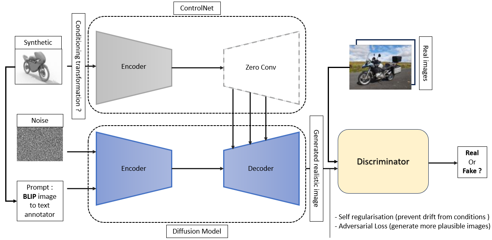

<h1>LLMs for data semantic augmentation</h1>

<h3>Project Goal</h1>
Using synthetically generated images for deep learning purposes has great advantages of perfect knowledge about the scenes parameters such as objects positions, depth, labels ... However, Training DL models directly on such datasets induces a biais which affects the model's performances on real world images (Domain shift problem). This project aims to enhance the realism of synthetic images and semantically augment the existing objects in a given scene using diffusion models.

<h3>Methodology</h1>

After close research in the <a href="https://confluencebdsfr.fsc.atos-services.net/display/BREBD/CV+%3A%3A+Data+%3A%3A+Synset+%3A%3A+Syn2Real+%3A%3A+State+of+the+art" target="_blank">state of the art</a>, ControlNet was found to be very suitable for our use case and its requirements. ControlNet combines good conditioning capacities with great generalization potential on top of light training costs. However, ControlNet alone is still not sufficient to generate hyper-realistic images.For this reason, it will be trained averserially with a discriminator that detects fake images from real images. The discriminator will push the generator (ControlNet) to produce images with high plausibility to be real (see strategy in figure below).   



<h3>Installation [Using Docker]</h1>

1. Clone the repository and its submodules:

    ```
    git clone https://github.gsissc.myatos.net/GLB-BDS-AILAB-CV/synset-poc-llm_data_augmentation.git
    cd synset-poc-llm_data_augmentation
    ```

2. Configure your environment variables in the `.env` file:

    ```python
    # Replace the fields with your personal informations
    HTTP_PROXY=
    HTTPS_PROXY=
    USER_NAME=
    USER_ID=
    GROUP_NAME=
    GROUP_ID=
    ```

3. Configure the volume mapping for your dataset in the `docker-compose.yaml` file:

    ```yaml
    ...

    volumes:
        - /YOUR/PATH/TO/THE/DATASET/IN/HOST:/home/${USER_NAME}/data
        - /YOUR/PATH/TO/THE/SRC_CODE/IN/HOST:/home/${USER_NAME}/src
    ...
    ```
    Ensure that the left part of the volume mapping corresponds to the dataset's path on your host machine.

4. Launch Docker:

    ```
    docker compose up
    ```

<!-- TODO : Update Readme -->