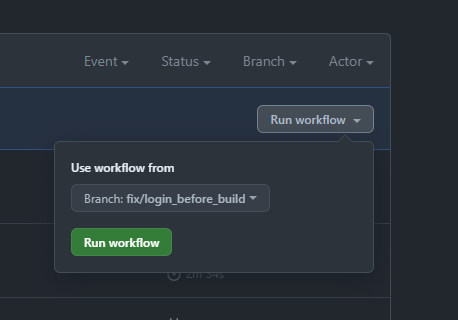
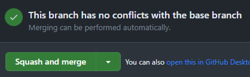
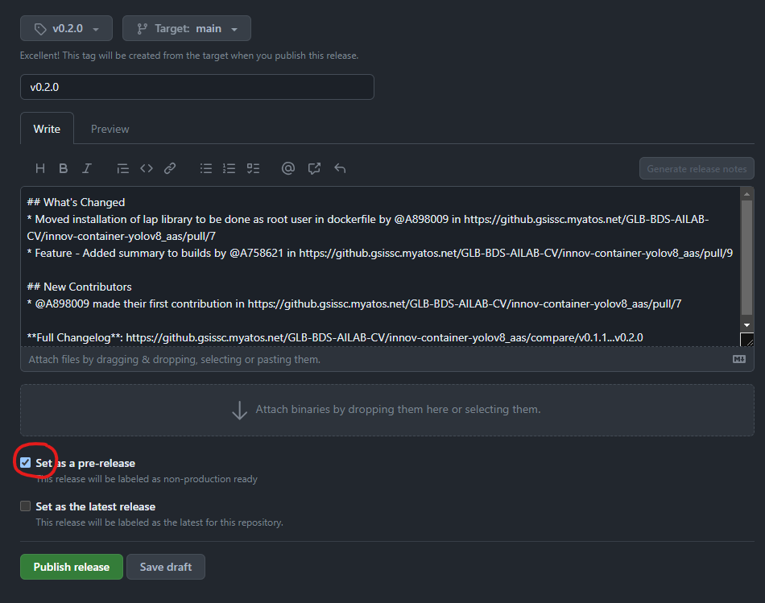
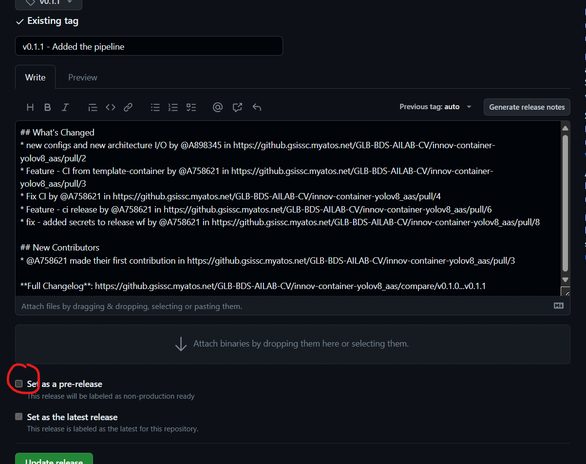
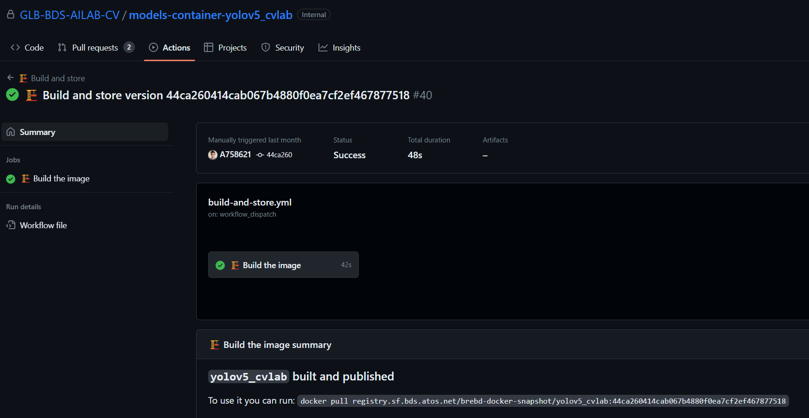

# Template Container with pipelines

## 💬 Description
This repo provides a generic container template with the pipeline to push images to the SF2 (snapshot and release).


## 🪲 Possibles Issues


## 🚨 IMPORTANT
**This repo should be use as a `template repository` when creating a new repo. It should NOT be cloned after the creation of a new repo.**  
To access the datasets in the container, don't forget to modify the volume in the compose.yaml file.  
Don't mount the full disk, only what you need.  
Mount your different datasets as different volumes.


## 🚀 How to Use
### Create a new GitHub repo
1. Follow [Repo naming convention link](https://confluencebdsfr.fsc.atos-services.net/x/BgCKFg)
2. Go to the [GitHub page of the BDS AILAB CV organization](https://github.gsissc.myatos.net/GLB-BDS-AILAB-CV). Scroll down to the *Repositories* section and click on `New`.
3. Under the *Repository template* section, select the `GLB-BDS-AILAB-CV/template-container` template ([More informations here](https://docs.github.com/en/repositories/creating-and-managing-repositories/creating-a-repository-from-a-template)). Alternatively, you can directly click on the green button "Use this template" that is on the top right corner of **this** github repository and select "Create a new repository"
4. Enter the *Repository name*
5. Create repository


### 🌳 Create a new branch
**👉 Follow [branch naming convention documentation](https://confluencebdsfr.fsc.atos-services.net/x/DwCKFg)**

### ⏱️ Trigger mechanism
To trigger the pipeline that will build and publish your image, you can use these mechanisms:  
#### Manual
Tag is the associated commit hash, [manual trigger link](https://docs.github.com/en/actions/using-workflows/manually-running-a-workflow).



If you click on the button as in the image above, the pipeline will build and push the image:
`yolov8_aas:<latest commit hash of branch selected>`

#### PR merged into main
Tag is main, [pull request link](https://docs.github.com/en/pull-requests/collaborating-with-pull-requests/incorporating-changes-from-a-pull-request/merging-a-pull-request)



Scroll down to the bottom of the `PR` then select the merge option available as in the above image selected `Squash and merge` , the pipeline will build and push the image:
`yolov8_aas:main`

### Pre-release
Tag is pre-release tag.



If you select the check box `Set as a pre-release` then click on the button `Publish release` as in the above image, the pipeline will build and push the image:
`yolov8_aas:v0.2.0` 

#### Release
Tag is release tag, [release link](https://docs.github.com/en/repositories/releasing-projects-on-github/managing-releases-in-a-repository#creating-a-release)



Uncheck `Set as a pre-release`, then click on the button `Update release`, the pipeline will build and push the image:
`yolov8_aas:v0.2.0 release`


### 🚫 Add `.env` to `.gitignore`
You must add the `.env` file to your `.gitignore` to not store secrets in github.  
You can edit `.env` with the environment variables for your local usage.

### ⚙️ Set environment variables for pipelines
#### 📁 Repository settings
You can edit the variables that are not set at organization level in the repository settings ([more information here](https://docs.github.com/en/actions/learn-github-actions/variables)).  
If you are using secrets with repository scope, document in a Confluence page how to get them.

#### 🔨 build-docker.yml
Once you have set the variables and secrets, you can reference them in the pipeline in `.github/workflows/build-docker.yml`.

```yaml
env:
  # Variables needed in docker compose
  GROUP_ID: ${{ secrets.GROUP_ID }}
```


In this example, `GROUP_ID: ${{ secrets.GROUP_ID }}` set the `GROUP_ID` environment variable with the `GROUP_ID` secret value set at organization level ([more information here](https://docs.github.com/en/actions/learn-github-actions/variables)).

#### 🐙 `docker-compose.yml`
The `docker compose build` command is now called with the right environment variables, and you have to pass them to the Dockerfile at build time ([more information here](https://docs.docker.com/compose/compose-file/compose-file-v3/#build))

**🚨 The `$REGISTRY` arg is mandatory to use the artifactory at build time**

**Example:**
```yaml
build:
  args:
    GROUP_ID: ${GROUP_ID}
``` 
   
#### 🐳 `Dockerfile`
Eventually, you can use these variables in your Dockerfile ([more information here](https://docs.docker.com/reference/dockerfile/#arg)).

*At build time:*
```Dockerfile
ARG GROUP_ID
```
*At run time:*
```Dockerfile
ENV GROUP_ID="${GROUP_ID}"
```
   
### 🎨 Customize your image
You can now use customize the image for your specific use case.

### ▶️ Modify `entrypoint`
You can either use a `.sh` or a `.py` file. 

### 🐳 Edit `Dockerfile`
👉 Follow [Dockerfile configuration link](https://docs.docker.com/engine/reference/builder/)

### 🐙 Edit `docker-compose.yml`
👉 Follow [docker-compose configuration link](https://docs.docker.com/get-started/08_using_compose/)

### ✒️ Update README file
You can edit the readme in the `docs` folder or override it by putting one at the root of the repository.

### ✅ How to validate
#### 🔀 Run build action on your branch
To validate the pipeline:
- click on the `Actions`.
- select `Build and store`.
- from `Run workflow` dropdown list select the `branch` that you want to run the pipeline on.
- click on `Run workflow`.

#### 👀 Get your PR reviewed
If the pipeline built successfully:
- create a Pull Request for the branch you built ([more information here]'https://docs.github.com/en/pull-requests/collaborating-with-pull-requests/proposing-changes-to-your-work-with-pull-requests/creating-a-pull-request)).
- follow the PR template.
- select a reviewer.
- add the link to the successful GitHub Action in the **🧪 How to test:** section of the description.
- set your PR from `Draft` to `Ready for review`.

#### 🆚 Compare to Example
You can compare your repository to those examples:
- [innov-container-yolov8_ass](https://github.gsissc.myatos.net/GLB-BDS-AILAB-CV/innov-container-yolov8_aas)
- [models-container-yolov5_cvlab](https://github.gsissc.myatos.net/GLB-BDS-AILAB-CV/models-container-yolov5_cvlab)

### 🧪 How to test your build
#### ⚙️ Configuration of the artifactory locally
Login to the `registry.sf.bds.atos.net` ([more information here](https://sf.bds.atos.net/cookbook/howtos/global-acces-RT.html)).


#### 📥 Pull the image
**🗼Once the pipeline successfully built**

Go to `Build and store` then click on the the pipeline that you built as above image.



In this picture, to use it I ran: `docker pull registry.sf.bds.atos.net/brebd-docker-snapshot/yolov5_cvlab:44ca260414cab067b4880f0ea7cf2ef467877518`
