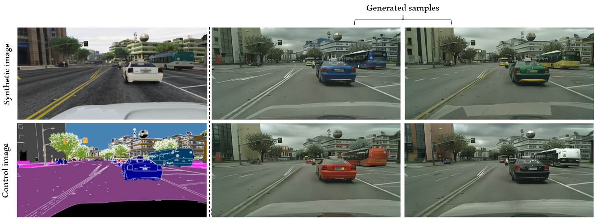
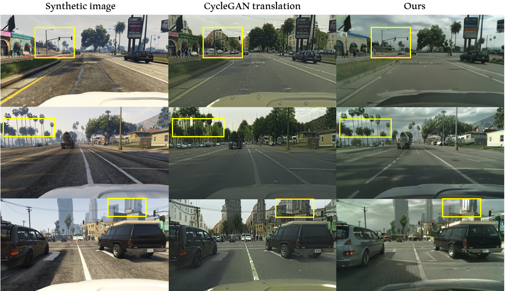
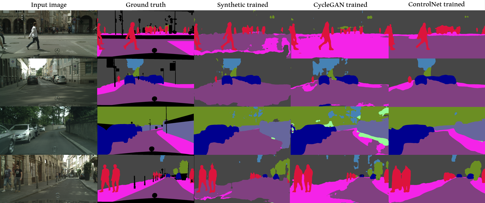

# LLMs for data semantic augmentation

## Description

This repository provides a proof of concept for semantic augmentation of synthetic images using diffusion models. Each pipeline component is encapsulated in a Docker container, and all containers (services) are managed through a Docker Compose file.

## Detailed documentation links

- State of the art study: [SOTA](https://github.com/bds-ailab/syn2real/blob/chore/opensourcing-project/12372-update_readme/docs/SOTA.md)

- General strategy: [General Approach](https://github.com/bds-ailab/syn2real/blob/chore/opensourcing-project/12372-update_readme/docs/general_approach.md)

- Training experiments and results: [CV:Data:Synset:Syn2Real:Controlnet training -BDS R&D CVLab-Confluence](https://confluencebdsfr.fsc.atos-services.net/pagesd/viewpage.action?pageId=618758247)

- Computation acceleration methods: [CV:Data:Synset:Syn2Real:Acceleration-BDS R&D CVLab-Confluence](https://confluencebdsfr.fsc.atos-services.net/display/BREBD/CV+%3A%3A+Data+%3A%3A+Synset+%3A%3Ad+Syn2Real+%3A%3A+Acceleration)

## Installation

1. Clone the repository and its submodules:

    ```bash
    git clone https://github.gsissc.myatos.net/GLB-BDS-AILAB-CV/synset-poc-llm_data_augmentation.git
    cd synset-poc-llm_data_augmentation
    ```

2. Copy the file .template-env and Configure your environment variables in the `.env` file:

    ```python
    # Replace the fields with your personal informations
    HTTP_PROXY=
    HTTPS_PROXY=
    USER_NAME=
    USER_ID=
    GROUP_NAME=
    GROUP_ID=
    # Add the absolute paths for the different folder for volumes mount 
    DATA_PATH=
    SRC_PATH=
    MODEL_PATH=
    OUT_PATH=
    ```

3. Build Docker services:

    ```bash
    docker compose up
    ```

## Important services

1. controlnet_sdxl: This service contains all the training & evaluation scripts for Controlnet-SDXL using FMLE experiments. The script [launch.sh](../src/controlnet_sdxl/launch.sh) starts the training of controlnet using previous checkpoints and a given dataset, it can be used to launch to the experiment on FMLE. the script will automatically create the output folders using the name given as argument.

    ```
    # Complete the output path of the checkpoints
    export OUTPUT_DIR="/out/..."
    # The original stable diffusion xl weights (don't modify)
    export MODEL_DIR="stabilityai/stable-diffusion-xl-base-1.0"
    # Modify if needed to start the training from previous checkpoints
    export CONTROLNET_DIR="None"
    # Modify if needed to start the training from previous checkpoints
    export UNET_DIR="None"
    ```

    The script [infer.sh](../src/controlnet_sdxl/infer.sh) transforms a synthetic dataset to the real domain using the given checkpoints and save it. Need to modify the checkpoints names for controlnet and unet to be used during the inference.

2. model_eval: This service encapsulates the evaluation methods by qualitative methods such as CLIP embeddings or quantitative methods by training an independent segmenter on the generated data and testing it on real images to measure the domain shift gap. The script [launch.sh](../src/model_eval/launch.sh) trains a DeepLabv3 segmentation model on a given dataset, test it on a real dataset and save the checkpoints and performances details.

    ```env
    # Specify the training dataset (typically generated images dataset)
    export TRAIN_DATA_DIR=
    # Specify the test dataset (typically real world images)
    export TEST_DATA_DIR=
    # Specify the ouput folder of the experiment 
    # where performance details and model checkpoint will be saved
    export EXP_OUT_FOLDER=
    ```

## Some Results

Here’s an example of our model's output from a synthetic input image with various instructions provided in the text prompt. The model successfully enhances the realism of synthetic images while adhering to prompt instructions, such as specific car colors, and preserving the semantic integrity of each object from the original image.



We also compared the generated results with other well-known state-of-the-art style translation models, such as CycleGAN-Turbo. Unlike CycleGAN, our model preserves the semantic layout of the image with high fidelity while achieving realistic textures.



Lastly, we compare the inference results of the segmentation model trained on various datasets, including the one generated by our style translation model. The segmenter’s output shows a remarkable improvement in detecting the different classes within the image.


